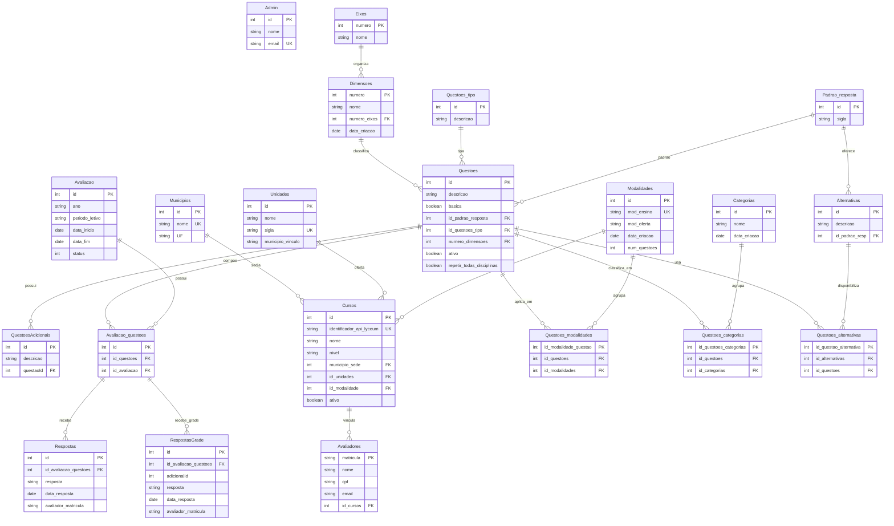

# Estrutura do Banco de Dados (ER)

Este documento descreve o modelo relacional do sistema CPA com base no arquivo `backend/prisma/schema.prisma`.

## Diagrama ER

## Observacoes Importantes

- O Prisma possui tabelas anotadas com `@ignore`/`@@ignore`, que nao sao expostas no Prisma Client para operacoes tipadas.
- Relacoes muitos-para-muitos implicitas entre `Avaliacao` e outras entidades (`Cursos`, `Categorias`, `Questoes`, `Modalidades`, `Unidades`) sao materializadas em tabelas de juncao gerenciadas pelo Prisma no banco.
- O diagrama acima prioriza as entidades funcionais principais e as tabelas de juncao explicitamente declaradas no schema.

## Tabelas Ignoradas no Prisma Client

- `Avaliacao_avaliadores` (`@@ignore`)
- `Questoes_avaliadores` (`@@ignore`)
- Campos com `@ignore`, como relacoes auxiliares em `Questoes`, `Cursos` e `Avaliadores`
